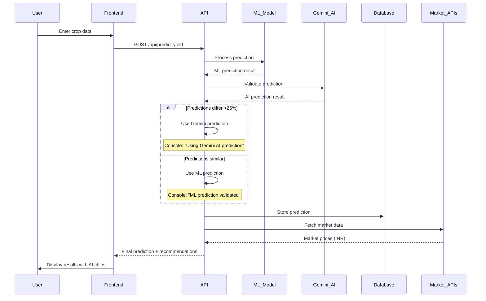
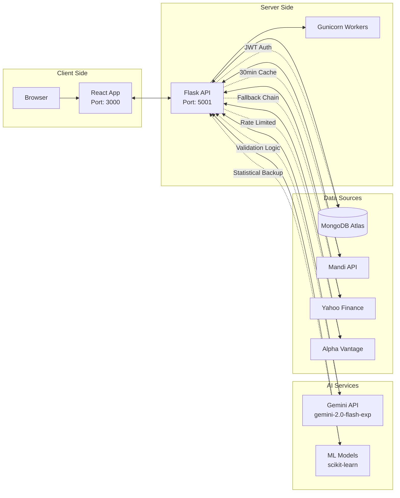

```mermaid
graph TB
    %% User Interface Layer
    subgraph "Frontend (React/TypeScript)"
        UI[User Interface]
        CP[CropPredictor.tsx]
        FD[FinancialDashboard.tsx]
        DD[DiseaseDetector.tsx]
        CB[Chatbot.tsx]
        CF[CommunityForum.tsx]
    end

    %% API Gateway Layer
    subgraph "Backend API (Flask/Python)"
        API[app_integrated.py<br/>Port: 5001]
        AUTH[Authentication Routes<br/>JWT + bcrypt]
        PRED[/api/predict-yield]
        FIN[/api/financial/*]
        CHAT[/api/mchatbot]
        DISEASE[/api/disease/*]
    end

    %% Business Logic Layer
    subgraph "Core Services"
        ML[colab_style_predictor.py<br/>RandomForest ML Model]
        STAT[Statistical Fallback<br/>Agricultural Averages]
        FA[financial_analyzer.py<br/>ROI Calculator]
        RMS[realtime_market_service.py<br/>Market Data Aggregator]
        DC[disease_detector.py<br/>CNN TensorFlow Model]
    end

    %% AI Validation Layer
    subgraph "Gemini AI Systems"
        GEMINI[Gemini AI 2.0 Flash<br/>google-generativeai]
        VAL[Yield Validation<br/>Cross-check ML predictions]
        REC[AI Recommendations<br/>Multi-language support]
        MLCHAT[Multilingual Chatbot<br/>6 languages]
    end

    %% Data Layer
    subgraph "Database & Storage"
        MONGO[(MongoDB Atlas<br/>Users, Predictions, Cache)]
        CACHE[Redis-like Caching<br/>Market data: 30min TTL]
    end

    %% External APIs
    subgraph "External Services"
        MANDI[data.gov.in<br/>Mandi Feed API<br/>Priority #1]
        YAHOO[Yahoo Finance API<br/>Priority #2]
        ALPHA[Alpha Vantage API<br/>Priority #3]
        WEATHER[OpenWeather API<br/>Climate data]
    end

    %% User Flow Connections
    UI --> CP
    UI --> FD
    UI --> DD
    UI --> CB
    
    %% API Connections
    CP --> PRED
    FD --> FIN
    DD --> DISEASE
    CB --> CHAT
    
    %% Authentication Flow
    UI --> AUTH
    AUTH --> MONGO
    
    %% Prediction Flow
    PRED --> ML
    ML -.-> STAT
    PRED --> VAL
    VAL --> GEMINI
    ML --> VAL
    
    %% Financial Flow
    FIN --> FA
    FIN --> RMS
    RMS --> MANDI
    RMS --> YAHOO
    RMS --> ALPHA
    
    %% Disease Detection Flow
    DISEASE --> DC
    
    %% Chatbot Flow
    CHAT --> MLCHAT
    MLCHAT --> GEMINI
    
    %% Data Storage
    ML --> MONGO
    FA --> MONGO
    RMS --> CACHE
    AUTH --> MONGO
    
    %% Recommendation Flow
    PRED --> REC
    REC --> GEMINI

    %% Styling
    classDef frontend fill:#e1f5fe,stroke:#01579b,stroke-width:2px
    classDef backend fill:#e8f5e8,stroke:#2e7d32,stroke-width:2px
    classDef ai fill:#fff3e0,stroke:#f57c00,stroke-width:2px
    classDef database fill:#f3e5f5,stroke:#7b1fa2,stroke-width:2px
    classDef external fill:#ffebee,stroke:#c62828,stroke-width:2px
    
    class UI,CP,FD,DD,CB,CF frontend
    class API,AUTH,PRED,FIN,CHAT,DISEASE,ML,STAT,FA,RMS,DC backend
    class GEMINI,VAL,REC,MLCHAT ai
    class MONGO,CACHE database
    class MANDI,YAHOO,ALPHA,WEATHER external
```

## 🔄 **Detailed User Journey Workflow**



## 📊 **Technical Architecture Diagram**

