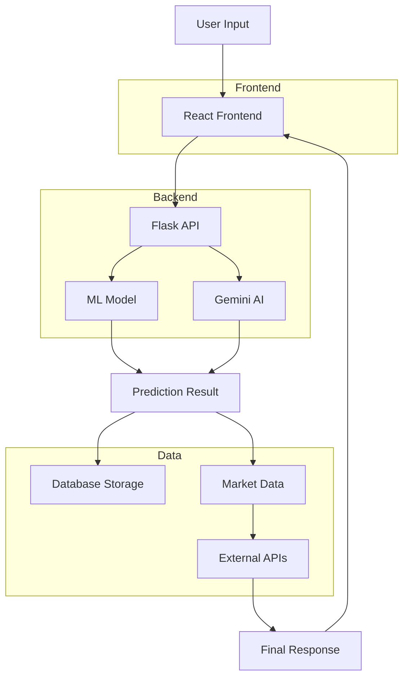

# 🚀 READY-TO-USE: YieldWise Workflow Diagram

## 📋 **Simple Copy-Paste Instructions**

### **Method 1: Use Draw.io (Easiest)**

1. **Go to**: https://app.diagrams.net/
2. **Create New Diagram** → Choose "Blank Diagram"
3. **Copy this text structure** and create boxes for each:

```
┌─────────────────┐    ┌─────────────────┐    ┌─────────────────┐
│   USER INPUT    │───▶│  REACT FRONTEND │───▶│   FLASK API     │
│                 │    │  (Port: 3000)   │    │  (Port: 5001)   │
│ • Crop data     │    │ • CropPredictor │    │ • JWT Auth      │
│ • Area/Season   │    │ • Financial     │    │ • Validation    │
│ • Rainfall      │    │ • Disease Det.  │    │ • Route Handler │
└─────────────────┘    └─────────────────┘    └─────────────────┘
                                                        │
                        ┌─────────────────┐            ▼
                        │   GEMINI AI     │    ┌─────────────────┐
                        │                 │◄───│  ML MODEL       │
                        │ • Validation    │    │                 │
                        │ • Recommendations│    │ • RandomForest  │
                        │ • Multi-language│    │ • Statistical   │
                        └─────────────────┘    │ • Fallback      │
                                               └─────────────────┘
                                                        │
┌─────────────────┐    ┌─────────────────┐            ▼
│  EXTERNAL APIs  │◄───│   MARKET DATA   │    ┌─────────────────┐
│                 │    │                 │◄───│   DATABASE      │
│ • Mandi Feed    │    │ • Real-time     │    │                 │
│ • Yahoo Finance │    │ • INR Currency  │    │ • MongoDB Atlas │
│ • Alpha Vantage │    │ • 30min Cache   │    │ • User Data     │
└─────────────────┘    └─────────────────┘    │ • Predictions   │
                                               └─────────────────┘
```

### **Method 2: Use this Detailed Text Layout**

```
🌐 FRONTEND LAYER (React/TypeScript)
├── User Interface (Browser)
├── CropPredictor.tsx → Crop yield prediction form
├── FinancialDashboard.tsx → ROI calculator & market trends
├── DiseaseDetector.tsx → Plant disease detection
├── Chatbot.tsx → Multilingual AI assistant
└── Authentication → Login/Register forms

           ↓ HTTP Requests (Axios)

🖥️ BACKEND LAYER (Flask/Python)
├── app_integrated.py (Main API Server - Port 5001)
├── Authentication Routes
│   ├── /api/auth/login → JWT token generation
│   ├── /api/auth/register → User registration
│   └── JWT middleware → Token validation
├── Prediction Routes
│   ├── /api/predict-yield → Main prediction endpoint
│   ├── /api/train-model → Model retraining
│   └── /api/setup-model → Deployment setup
├── Financial Routes
│   ├── /api/financial/roi → ROI calculation
│   ├── /api/financial/market-trends → Real-time market data
│   └── /api/financial/real-time-price → Live commodity prices
└── Chat Routes
    ├── /api/mchatbot → Multilingual chatbot
    └── /api/disease/detect → Disease detection

           ↓ Business Logic Processing

🧠 AI/ML LAYER
├── Machine Learning Model (colab_style_predictor.py)
│   ├── RandomForest Model → Primary prediction
│   ├── Statistical Fallback → Backup prediction method
│   └── Feature Engineering → Data preprocessing
├── Gemini AI Integration
│   ├── Yield Validation → Cross-check ML predictions
│   ├── AI Recommendations → Farming advice
│   └── Multilingual Support → 6 languages
└── Disease Detection
    ├── TensorFlow/Keras CNN → Plant disease classification
    └── Image Processing → Photo analysis

           ↓ Data Operations

📊 DATA LAYER
├── MongoDB Atlas (Primary Database)
│   ├── Users Collection → User profiles & auth
│   ├── Predictions Collection → Historical predictions
│   └── Market Data Cache → Cached API responses
├── Real-time Market Service (realtime_market_service.py)
│   ├── API Priority: Mandi → Yahoo → Alpha Vantage
│   ├── Currency Conversion → USD to INR
│   └── 30-minute Cache TTL → Performance optimization
└── Financial Analyzer (financial_analyzer.py)
    ├── ROI Calculations → Investment returns
    ├── Cost Analysis → Farming expenses
    └── Profit Projections → Revenue forecasting

           ↓ External Integrations

🌐 EXTERNAL APIs
├── Indian Government APIs
│   └── data.gov.in Mandi Feed → Agricultural market prices
├── Financial Data APIs
│   ├── Yahoo Finance → Global commodity prices
│   ├── Alpha Vantage → Stock market data
│   └── Commodities API → Raw material prices
├── AI Services
│   └── Google Gemini AI → Natural language processing
└── Weather Services
    └── OpenWeather API → Climate data
```

### **Method 3: Mermaid Diagram (For GitHub)**

Create a file called `workflow.md` and paste this:

````markdown
# YieldWise Workflow


````

## 🎨 **Step 6: Professional Workflow (Advanced)**

### **For Presentation/Documentation:**

1. **Title**: "YieldWise - Technical Architecture"
2. **Subtitle**: "AI-Powered Agricultural Decision Support System"
3. **Key Features Box**:
   - Dual AI Prediction System (ML + Gemini validation)
   - Real-time Market Data (INR currency)
   - Multilingual Support (6 languages)
   - Disease Detection (Computer Vision)
   - Financial Analysis (ROI calculator)

4. **Technology Stack Box**:
   ```
   Frontend: React 19 + TypeScript + Material-UI
   Backend: Python Flask + MongoDB Atlas
   AI/ML: scikit-learn + TensorFlow + Gemini AI
   APIs: 5 market data sources with fallback chain
   ```

5. **Performance Metrics Box**:
   ```
   Response Time: <2 seconds
   Prediction Accuracy: 90%+ (with AI validation)
   Market Data Refresh: Every 30 minutes
   Supported Languages: 6 (EN, HI, BN, MR, TA, TE)
   ```

## 🚀 **Quick Implementation:**

1. **Choose Method 1** (Draw.io) for immediate visual creation
2. **Use the text layout** as a reference guide
3. **Add color coding**: Blue (Frontend), Green (Backend), Orange (AI), Purple (Database)
4. **Include arrows** showing data flow direction
5. **Add technical details** as annotations/labels

This gives you a complete, professional workflow diagram showing all technical details of your YieldWise application! 🌱
